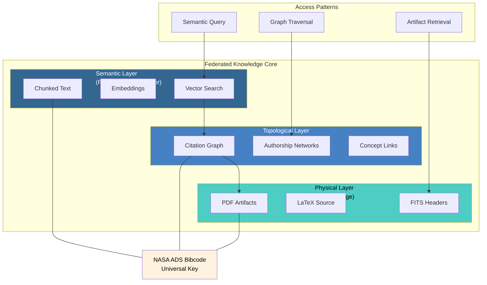

<!--
---
title: "Astronomy RAG Corpus"
description: "Specialized astronomical knowledge corpus for Retrieval-Augmented Generation supporting DESI research"
author: "VintageDon"
date: "2025-12-29"
version: "1.0"
status: "Active"
tags:
  - type: project-root
  - domain: [corpus, rag, astronomy]
  - tech: [python, postgresql, neo4j, langraph, mcp]
related_documents:
  - "[DESI Cosmic Void Galaxies](https://github.com/Proxmox-Astronomy-Lab/desi-cosmic-void-galaxies)"
  - "[DESI QSO Anomaly Detection](https://github.com/Proxmox-Astronomy-Lab/desi-qso-anomaly-detection)"
  - "[DESI Quasar Outflows](https://github.com/Proxmox-Astronomy-Lab/desi-quasar-outflows)"
---
-->

# 📚 Astronomy RAG Corpus

[](https://www.postgresql.org/)
[](https://neo4j.com/)
[](https://github.com/pgvector/pgvector)
[](https://www.python.org/)
[](https://langchain-ai.github.io/langgraph/)
[](LICENSE)


> A Federated Knowledge Core for astronomical research — decoupling semantic meaning from structural relationships to enable expert-level RAG and autonomous Deep Research agents.

This repository builds a specialized knowledge corpus from astronomical literature, designed to support Retrieval-Augmented Generation (RAG) for the DESI research portfolio. The system grounds LLM responses in verifiable scientific data, preserves citation topology, and enables multi-step research workflows through Claude Code and MCP integration.

---

## 🔭 Background

Building a scientific RAG system extends far beyond document aggregation. Astronomical literature contains complex mathematical notation, specialized terminology, and a rapidly evolving research landscape. Most critically, an AI agent for scientific discovery cannot operate on ambiguous information — its knowledge must be traceable, accurate, and contextually rich.

Retrieval-Augmented Generation (RAG) addresses LLM hallucination by grounding responses in retrieved documents. Standard RAG retrieves semantically similar text chunks, but scientific questions often require understanding *how papers relate* — which work refutes another, who the key authors are, what foundational papers underpin a claim.


This system implements a Federated Knowledge Core that separates:

- What papers say (semantic content via embeddings)
- How papers connect (citation topology via graph)
- Where artifacts live (physical storage for reproducibility)

The architecture enables "Graph-Boosted Retrieval" — semantic search results refined by citation topology. A query about "DESI void galaxy quenching" retrieves relevant chunks, then expands context to include highly-cited foundational papers that may not semantically match but are topologically indispensable.

---

## 🎯 Research Portfolio

This corpus supports the Proxmox Astronomy Lab's DESI research portfolio:

| Project | Focus | Corpus Role |
|---------|-------|-------------|
| [desi-cosmic-void-galaxies](https://github.com/Proxmox-Astronomy-Lab/desi-cosmic-void-galaxies) | Environmental quenching, ARD factory | Primary consumer — void science literature |
| [desi-qso-anomaly-detection](https://github.com/Proxmox-Astronomy-Lab/desi-qso-anomaly-detection) | ML anomaly detection on QSO spectra | QSO/AGN methodology papers |
| [desi-quasar-outflows](https://github.com/Proxmox-Astronomy-Lab/desi-quasar-outflows) | AGN feedback and outflow energetics | Outflow physics literature |

Seed corpus focus: DESIVAST (void catalog methodology) — central to all three projects.

---

## 🏗️ Architecture

### Federated Knowledge Core

The system decouples content from context, bridged by NASA ADS Bibcode as the universal key.



### Corpus Quality Hierarchy

Data sources prioritized by structure, fidelity, and reliability:

| Level | Source | Content | Fidelity |
|-------|--------|---------|----------|
| 1 | DESI, SIMBAD, VizieR | Structured catalog data | Ground truth |
| 2 | FITS Headers | Observational metadata | Instrument provenance |
| 3 | arXiv LaTeX | Clean text from source | High fidelity |
| 4 | PDF Extraction | Text from rendered documents | Best effort |

LaTeX-first extraction is critical — PDF-to-text conversion corrupts mathematical notation, mangles equations, and introduces OCR artifacts that poison the embedding space.

---

## 📋 Implementation Phases

| Phase | Name | Status | Description |
|-------|------|--------|-------------|
| 01 | [Ideation and Setup](work-logs/01-ideation-and-setup/README.md) | ✅ Complete | GDR review, repo initialization |
| 02 | Plan Review | ⬜ Next | Validate seed corpus against 2026 research priorities |
| 03 | Foundation | ⬜ Planned | Walking skeleton: single paper → retrieval loop |
| 04 | Harvester | ⬜ Planned | ADS/arXiv acquisition, seed corpus population |
| 05 | Hybrid Engine | ⬜ Planned | Neo4j graph construction, hybrid retrieval |
| 06 | Agent | ⬜ Planned | LangGraph state machine, multi-step research |
| 07 | Interface | ⬜ Planned | MCP servers, Claude Code integration |

### Walking Skeleton (Phase 03)

The minimal end-to-end loop proving the architecture:

```
arXiv ID → download source → LaTeX extraction → clean text + bibcode → PostgreSQL → semantic query → return with attribution
```

No catalog integration, no Neo4j, no MCP — just the text pipeline.

---

## 🖥️ Infrastructure

This project runs on the [Proxmox Astronomy Lab](https://github.com/Proxmox-Astronomy-Lab/proxmox-astronomy-lab) research cluster.

| Component | Resource | Purpose |
|-----------|----------|---------|
| PostgreSQL + pgvector | radio-pgsql01 (10.25.20.8) | Semantic layer, embeddings, vector search |
| Neo4j | radio-neo4j01 (10.25.20.21) | Topological layer, citation graphs |
| SMB Storage | radio-fs02 (10.25.20.15) | Physical layer, PDF/LaTeX artifacts |
| GPU | radio-gpu01 (A4000, 16GB) | Embedding generation |
| Database | `astronomy_rag_corpus` | Dedicated corpus database |

Connection patterns follow the standard `/opt/global-env/research.env` configuration.

---

## 📁 Repository Structure

```markdown
astronomy-rag-corpus/
├── .internal-files/              # GDR documents (gitignored)
├── docs/                         # Documentation
│   ├── data-science-infrastructure.md
│   └── documentation-standards/  # Templates and tagging
├── scratch/                      # Working files (gitignored)
├── work-logs/                    # Milestone-based development
│   └── 01-ideation-and-setup/
├── LICENSE
└── README.md                     # This file
```

---

## 🔧 Key Technologies

| Category | Technology | Purpose |
|----------|------------|---------|
| Databases | PostgreSQL 16 + pgvector | Vector storage, semantic search |
| | Neo4j 5 | Citation graphs, authorship networks |
| Ingestion | arxiv.py | arXiv paper retrieval |
| | ads | NASA ADS bibliographic data |
| | pylatexenc | LaTeX → clean text |
| | PyMuPDF | PDF extraction (fallback) |
| | astropy | FITS header extraction |
| Orchestration | LangGraph | Stateful agentic workflows |
| Interface | MCP | Claude Code integration |

---

## 🤝 OSS Program Acknowledgments

This repository benefits from open source programs that provide free or discounted tooling to qualifying public repositories.

### Active

| Program | Provides | Use Case |
|---------|----------|----------|
| [CodeRabbit](https://coderabbit.ai) | AI code review (Pro tier) | PR review with codebase context |
| [Atlassian](https://www.atlassian.com/software/views/open-source-license-request) | Jira, Confluence (Standard tier) | Project tracking, documentation |

### Available

| Program | Provides | Planned Use |
|---------|----------|-------------|
| [Snyk](https://snyk.io/plans/) | Security scanning | Dependency vulnerability detection |
| [SonarCloud](https://www.sonarsource.com/open-source-editions/) | Code quality analysis | Static analysis |

---

## 📄 License

[MIT](LICENSE) © 2025 VintageDon

---

## 🙏 Acknowledgments

- [DESI Collaboration](https://www.desi.lbl.gov/) — Data releases and VAC documentation
- [NASA ADS](https://ui.adsabs.harvard.edu/) — Bibliographic data and API access
- [arXiv](https://arxiv.org/) — Open access preprints
- [CDS](https://cds.u-strasbg.fr/) — SIMBAD and VizieR services
- Proxmox Astronomy Lab — Research infrastructure

---

Last Updated: December 29, 2025 | Current Phase: 01 Ideation and Setup Complete
